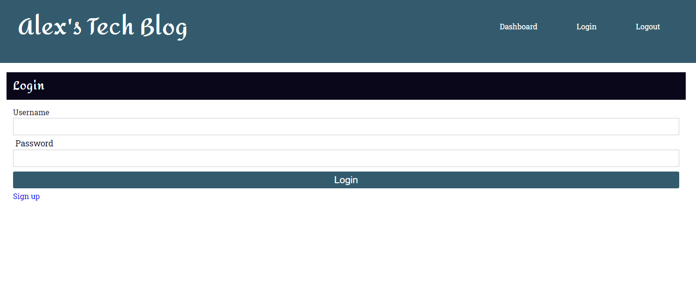
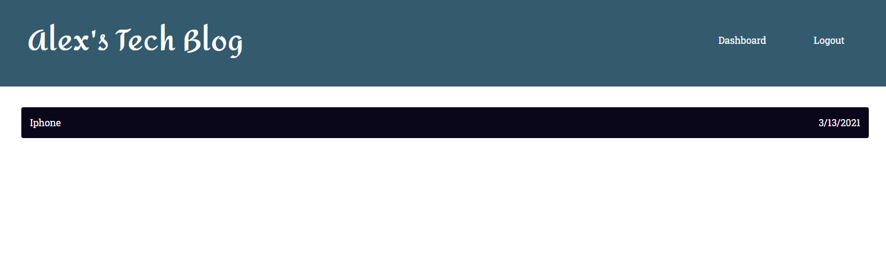
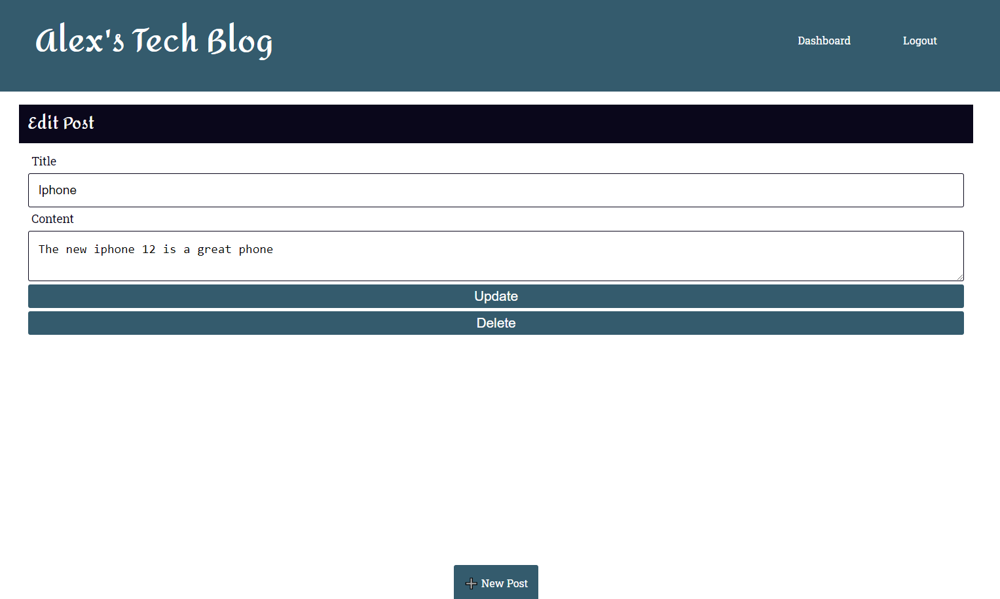
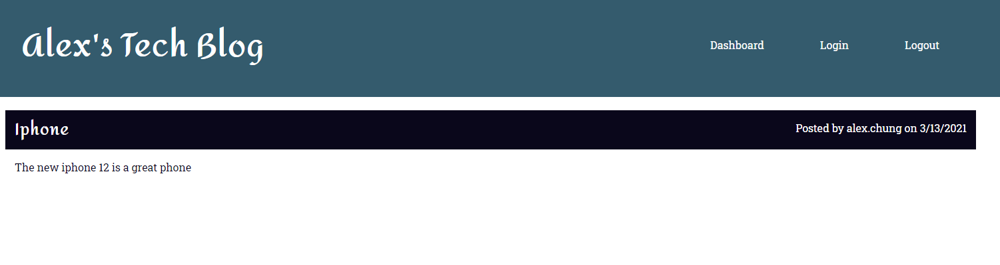
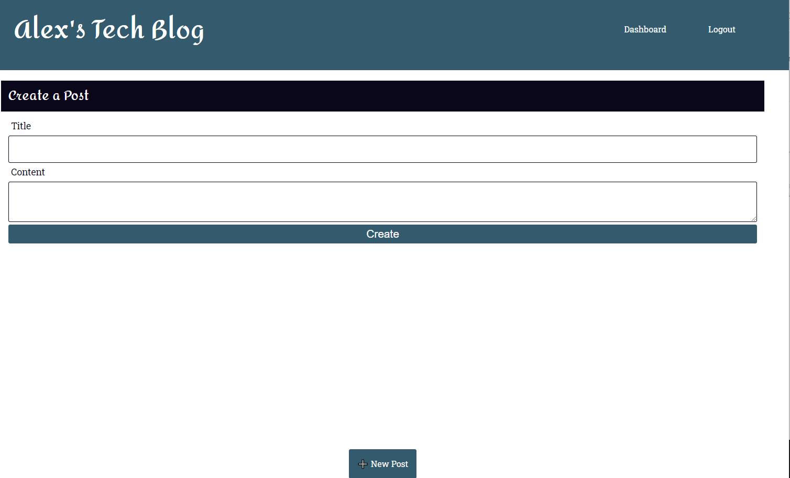

# Tech Blog
A blog application with the MVC paradigm in its architectural sstrcuture using Handlebars.js as the template language, Sequelize as the ORM, and the express-session npm package for authentication.

## Table of Contents
* Overview
* Technologies
* Status
* Screenshot

## Overview
An app that shows user the existing blogs on homepage, allows user to sign up, user has to sign in to create a post, all blog posts have title, contents, creator's name and date created. The user has to sigin in to be able to leave commment on a post. The signed in user is able to update or delete their posts.

## Technologies
Project created with:
* Node
* JS
* Express Handlebars
* dotenv
* Node MySQL2
* node.bcrypt.js
* Sequelize
* express.session
* connect-session-sequalize
* Heroku

## Status
To view the app please visit the below.

[Tech Blog](https://tech-blog1992.herokuapp.com/login)

## Screenshot

)
)
)
)
)